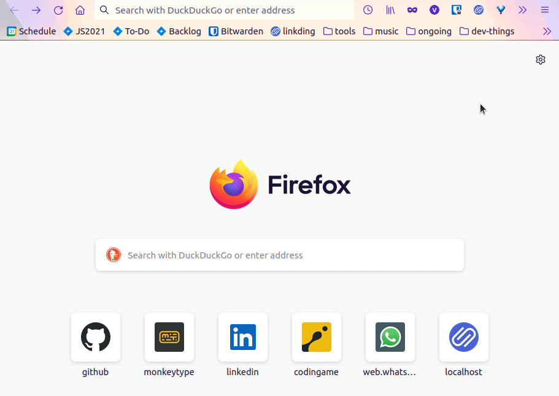

# DIEC2 OpenSearch

Fitxers de descripció OpenSearch pels següents recursos lingüístics:

- Diccionari de la llengua catalana de l'Institut d'Estudis Catalans ([DIEC2](https://dlc.iec.cat/))
- [Diccionari de sinònims d'Albert Jané](https://sinonims.iec.cat/)
- [ésAdir de la CCMA](https://esadir.cat/)

Segueix les instruccions a [la pàgina web](https://victor-gp.github.io/diec2-opensearch/) per afegir-los com a motor de cerca directa al Firefox.

Més informació:

- Motors de cerca directa: <https://www.ub.edu/retrucs/motors-cerca-directa/>
- Fitxers de descripció OpenSearch (en anglès): <https://developer.mozilla.org/en-US/docs/Web/OpenSearch>
